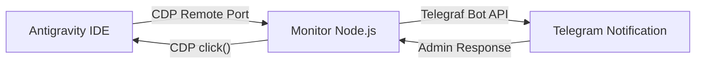

# PRD: Antigravity 核准通知系統

## 1. 產品概述

| 項目 | 內容 |
|------|------|
| **產品名稱** | Antigravity Notify |
| **產品類型** | 通知與審批系統 |
| **核心功能** | 監控 Antigravity AI IDE 執行狀態，當需要使用者核准時透過 Telegram 發送通知，並支援直接回覆核准 |
| **目標使用者** | 使用 Antigravity IDE 的開發者 |

---

## 2. 背景與動機

Antigravity AI IDE 在執行過程中會有需要使用者確認或核准的場景（如：代碼審查、風險操作確認、敏感權限請求）。目前缺乏主動通知機制，導致使用者必須持續盯著 IDE 畫面，降低工作效率。

本系統旨在：
- **即時通知**：不漏接任何核准請求
- **快速回應**：透過 Telegram 直接核准，無需切換上下文
- **完整記錄**：留存所有操作軌跡與日誌

---

## 3. 使用者故事

| 編號 | 使用者故事 | 優先級 |
|------|-----------|--------|
| 作為開發者，當 Antigravity 需要核准時，我希望透過 Telegram 收到通知，這樣我就不需要一直盯著 IDE 畫面 | P0 |
| 作為開發者，我希望直接回覆 Telegram 訊息來核准，這樣可以快速回應而不需要切換到 IDE | P0 |
| 作為開發者，我希望查看歷史核准記錄，方便稽核與問題排查 | P1 |
| 作為開發者，我希望系統能區分不同類型的核准請求，讓我能快速判斷優先級 | P2 |

---

## 4. 功能需求

### 4.1 UI 監控 (UI Monitoring via CDP)

- [x] **監控來源**：透過 Chrome DevTools Protocol (CDP) 連接 Antigravity IDE 的偵錯端口
- [x] **UI 解析**：解析 DOM 樹以識別「代碼核准」、「終端命令執行」等按鈕與狀態
- [x] **狀態追蹤**：即時監測 DOM 變化，主動推播新事件

### 4.2 Telegram 通知

- [x] **Bot 設定**：建立 Telegram Bot，取得 API Token
- [x] **認證綁定**：使用者透過 /start 命令綁定 Telegram Chat ID
- [x] **訊息格式**：
  - 標題：核准類型（如：代碼審查、風險操作）
  - 內容：請求摘要、相關檔案、操作說明
  - 按鈕：快速核准/拒絕（透過 Inline Keyboard）

### 4.3 核准回覆機制

- [x] **指令回覆**：支援回覆訊息內容（如回覆「yes」或「approve」）
- [x] **Inline 按鈕**：提供「✅ 核准」與「❌ 拒絕」按鈕
- [x] **核准驗證**：確認操作安全性（可選：設定白名單指令）

### 4.4 記錄與查詢

- [x] **歷史記錄**：儲存所有通知與回覆歷史（SQLite/檔案）
- [x] **查詢指令**：/history 查看歷史記錄
- [x] **匯出功能**：匯出為 JSON/CSV（可選）

---

## 5. 非功能需求

| 項目 | 需求 |
|------|------|
| **延遲** | 通知延遲 < 3 秒 |
| **可靠性** | 支援離線重連，日誌監控不漏失 |
| **安全性** | Telegram Bot Token 需加密儲存，核准動作需二次確認（可選） |
| **擴展性** | 支援多個專案配置 |

---

## 6. 技術架構建議

### 6.1 技術選型

| 層面 | 技術 |
|------|------|
| **監控核心** | Node.js (Async/Await) |
| **通訊協議** | Chrome DevTools Protocol (CDP) |
| **關鍵庫** | `puppeteer-core` (連接 CDP), `telegraf` (Telegram SDK) |
| **資料儲存** | LowDB 或 SQLite (用於歷史記錄) |
| **部署方式** | PM2 管理或 Docker |

### 6.2 系統架構圖

---

## 7. 實作里程碑

| 階段 | 內容 | 預估天數 |
|------|------|----------|
| Phase 1 | 基本日誌監控 + Telegram 通知 | 1-2 天 |
| Phase 2 | 核准回覆機制（指令/按鈕） | 1-2 天 |
| Phase 3 | 歷史記錄與查詢功能 | 1 天 |
| Phase 4 | 安全性強化、部署包裝 | 1 天 |

---

## 8. 風險與假設

| 風險 | 緩解措施 |
|------|----------|
| Antigravity DOM 結構變更 | 實作抽象層解析 UI，降低對特定 Selector 的依賴 |
| Telegram Bot API 限制 | 遵守速率限制，設計重試機制 |
| 遠端操作安全性 | 增加二次驗證或 Chat ID 白名單機制 |

---

## 9. 待確認事項

- [ ] Antigravity 的日誌檔案路徑或輸出方式為何？
- [ ] 需要支援哪些類型的核准請求？
- [ ] 核准後的實際操作如何觸發？（透過 API？檔案修改？）

---

**文件版本**：v1.0  
**建立日期**：2026-02-26  
**作者**：AI Assistant
